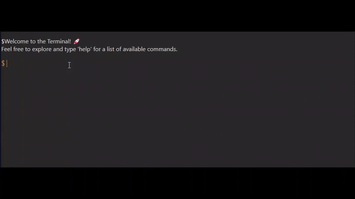
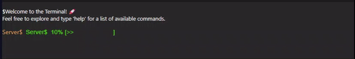

<!-- Welcome to CodeBook Terminal! -->

# CodeBook Terminal 🚀

[](https://github.com/adhithyankrishna/codebook-terminal/stargazers)
[](https://github.com/adhithyankrishna/codebook-terminal/network/members)
[](https://github.com/adhithyankrishna/codebook-terminal/issues)

---

### 🌈 Welcome to the Colorful World of CodeBook Terminal!

Elevate your coding experience with CodeBook Terminal – where functionality meets flair in the most colorful way possible! 🎨💻

## Key Features

- **Sleek Design:** A visually appealing terminal that turns coding into an immersive journey.

- **Customizable Themes:** Tailor the appearance to match your coding personality.

- **User-Friendly Interface:** Whether you're a pro or just starting, our terminal makes coding stylish and intuitive.

- **Dynamic Commands:** Explore a plethora of available commands, each with its own distinct flavor.

---

## Getting Started

1. **Installation:**
    ```bash
    npm install codebook-terminal
    ```

2. **Usage:**
    ```javascript
    import CodebookTerminal from "codebook-terminal";

    // Your code here
    ```

3. **Customization:**
    Explore the `themes` folder for exciting theme options!

---

## Let's Get Coding! 🚀

Ready to unleash your creativity? Dive into CodeBook Terminal and let every line of code become a stroke of brilliance! 🌟

---
# Terminal Component README

Welcome to the README for the Terminal component! 🚀 This versatile React component allows you to create an interactive terminal experience in your applications.

## Props

### `setUserInput`
- **Type:** Function
- **Description:** Callback function to handle user input.

### `userOutput`
- **Type:** String
- **Description:** Output from user commands or responses.

### `mode`
- **Type:** String
- **Description:** Determines the mode of the terminal (e.g., "command" or "progressBar").

### `userCommand`
- **Type:** Object
- **Description:** Custom user commands to extend the functionality of the terminal.

### `background`
- **Type:** String (Hex Color)
- **Default:** `#292929`
- **Description:** Background color of the terminal.

### `welcomeMessage`
- **Type:** String
- **Default:** "Welcome to the Terminal! 🚀\nFeel free to explore and type 'help' for a list of available commands."
- **Description:** Initial message displayed when the terminal is loaded.

### `textColor`
- **Type:** String (Hex Color)
- **Default:** `#dbd8d5`
- **Description:** Text color of the terminal.

### `promtColor`
- **Type:** String (Hex Color)
- **Default:** `#d6994a`
- **Description:** Prompt text color.

### `promtText`
- **Type:** String
- **Default:** "$"
- **Description:** Text displayed in the prompt.

### `progressBarColor`
- **Type:** String (Hex Color)
- **Default:** `#50f50f`
- **Description:** Color of the progress bar.

### `progres`
- **Type:** Number
- **Default:** 0
- **Description:** Progress value for the progress bar.

## Example Usage

```jsx
import CodebookTerminal from "codebook-terminal";

const MyTerminalApp = () => {
  return (
    <CodebookTerminal
      setUserInput={handleUserInput}
      userOutput={outputMessage}
      mode="command"
      userCommand={{ customCommand: { description: "Custom command", usage: "customCommand", fn: () => {} } }}
      background="#292929"
      welcomeMessage="Welcome to My App!"
      textColor="#dbd8d5"
      promtColor="#d6994a"
      promtText="$"
      progressBarColor="#50f50f"
      progres={50}
    />
  );
};

export default MyTerminalApp;


``````



###Progress Bar 🎉🎉🎉



### 🤝 Contributing

We welcome contributions! Feel free to open issues, submit pull requests, or share your feedback.

### 📝 License

This project is licensed under the [MIT License](LICENSE).

### 👤 Author


[Adithyan M]

---

Enjoy coding with CodeBook Terminal – where coding meets creativity!

[](https://github.com/adhithyankrishna/codebook-terminal)
